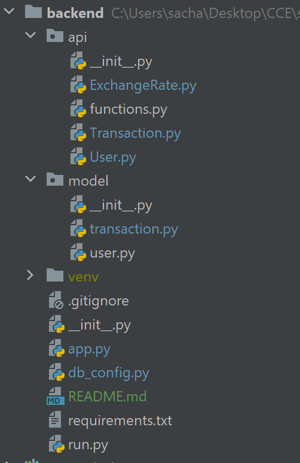
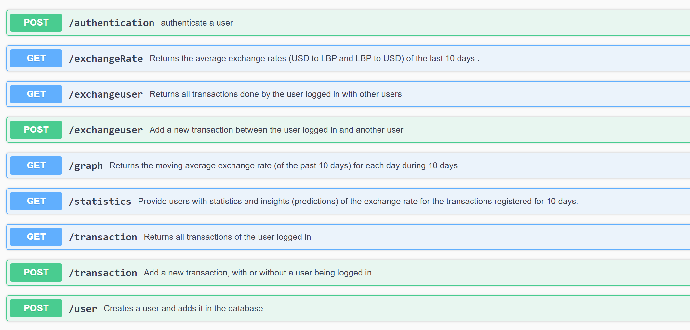

# Backend
Backend done using Flask and MySQL

## How to set it up
1. Clone the repo by creating a folder, opening the cmd and chage directory to this folder. Write "git clone https://github.com/KevinZiadeh/Exchange-Rate-App.git" then cd backend
2. Create a new environment by using: "py -3 -m venv venv", then activate it using "venv\Scripts\activate"
3. Execute "pip install -r requirements.txt", which will use pip to install all the dependencies specified in requirements.txt file
4. Create/Edit db_config.py so it holds your credentials on MYSQL:
    Write in it: "DB_CONFIG='mysql+pymysql://<mysql_username>:<mysql_password>@<mysql_host>:<mysql_port>/<mysql_db_name>'"
5. Using python shell within the virtual environment, to initialize the database and create the needed databases, write:
   1. from app import db
   2. db.create_all()
   3. exit()
6. To run the application, write: "python run.py"

## Database:
It contains 2 models:
1. User:
   * Attributes:
     * id: integer, primary key 
     * user_name: string(30), unique 
     * hashed_password: string(128)
     
2. Transaction:
      * Attributes:
        * id: integer, primary key 
        * usd_amount: float,non-nullable 
        * lbp_amount:float, non-nullable 
        * usd_to_lbp: boolean, non-nullable 
        * added_date: Datetime 
        * user_id: integer, foreign key(user.id), nullable 
        * receiver_name: string(30), foreign key(user.user_name), nullable

## Architecture:
The APIs are all found in the folder API divided into three files: ExchangeRate.py, Transaction.py and User.py
They are linked to two models: user and transaction which are in the database

  

## Documentation:
We used Swagger for api's documentation:
Run the application, and enter "http://localhost:5000/apidocs/#/", you should see this doc:

  

